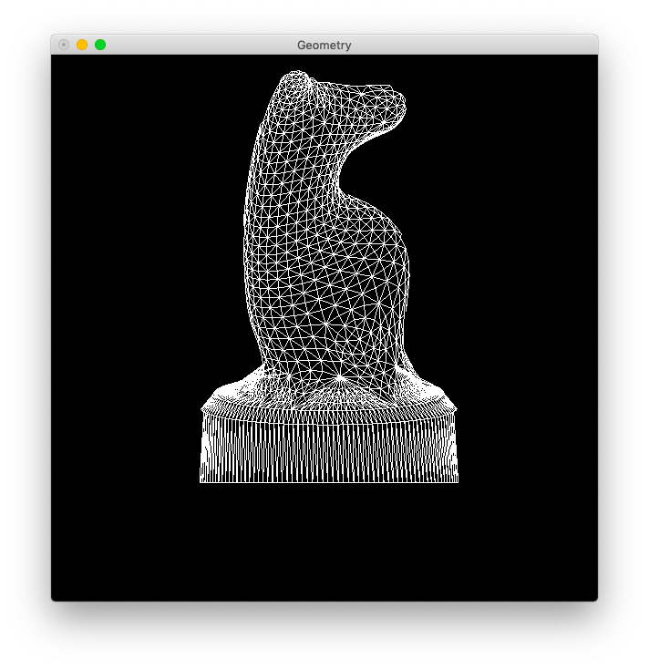

# Lab 1

Zhicheng Zhang

### Usage

- Install [Python 3](https://www.python.org/).
- Install dependence by `pip3 install -r requirements.txt`.
- Change file `camera.txt` to modify camera parameters.
- Change file `geometry.d.txt` to draw different geometries.
- Execute `python3 main.py` to show geometry on screen.

### Result

Each geometry has two images:

- show back face (set parameter `remove_back_face` as `0`)
- hide back face (set parameter `remove_back_face` as `1`)

#### House

Copy file `house.d.txt` to file `geometry.d.txt`.

Change file `camera.txt` as:

```
C 80 20 80
P_{ref} -20 20 0
V' 0 1 0
h 5
d 10
f 100
remove_back_face 0
```


#### Knight

Copy file `knight.d.txt` to `geometry.d.txt`.

Change file `camera.txt` as:

```
C 5 -5 0
P_{ref} 0 0 2
V' 0 0 1
h 1
d 2
f 20
remove_back_face 0
```




