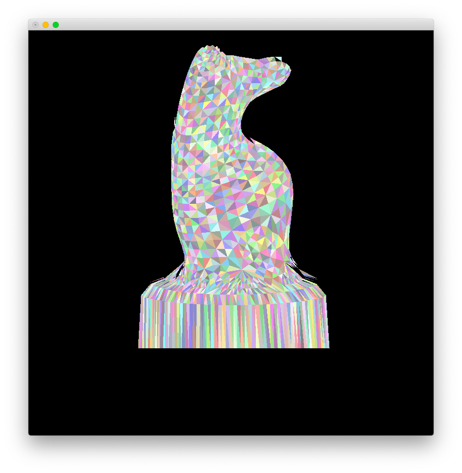

# Lab 2

Zhicheng Zhang

### Usage

- Install [Python 3](https://www.python.org/).
- Install dependence by `pip3 install -r requirements.txt`.
- modify `main.py` to draw different geometries.

``` python
...

def main():
    print('Reading ...')
    start = datetime.datetime.now()

    house_world = Space()
    house_world.append_by_file('house.d.txt')  # change geometry data

    camera = Camera()
    camera.set_by_file('camera.house.d.txt')  # change camera profile

    display = Display()
    display.set(800)  # change window size
    
...
```

- Execute `python3 main.py` to show.

### Result

#### House

Use `house.d.txt` and `camera.house.d.txt`.

```
C 80 20 80
P_{ref} -20 20 0
V' 0 1 0

h 5
d 10
f 100
```

Result:


```
Reading ...
Finish. (cost = 0:00:00.002792)

Calculating #1 ...
Finish. (cost = 0:00:00.002122)

Calculating #2 ...
Finish. (cost = 0:00:02.966088)

Rendering ...
Finish. (cost = 0:00:01.012656)
```

#### Knight

Use `knight.d.txt` and `camera.knight.d.txt`.

```
C 5 -5 0
P_{ref} 0 0 2
V' 0 0 1

h 1
d 2
f 20
```

Result:



```
Reading ...
Finish. (cost = 0:00:00.400773)

Calculating #1 ...
Finish. (cost = 0:00:00.627051)

Calculating #2 ...
Finish. (cost = 0:00:09.706174)

Rendering ...
Finish. (cost = 0:00:02.581282)
```
