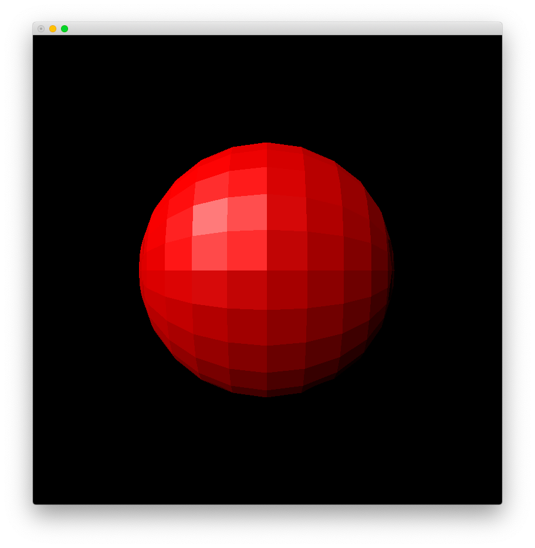
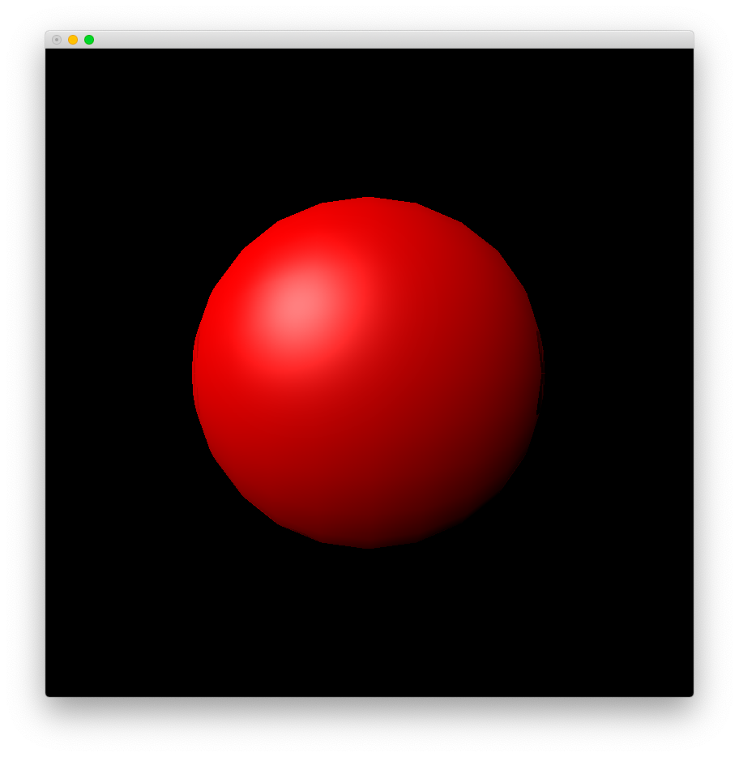
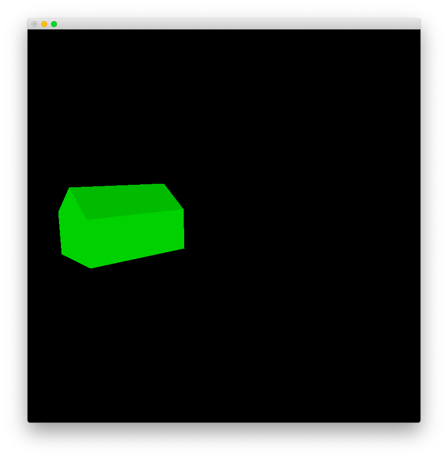
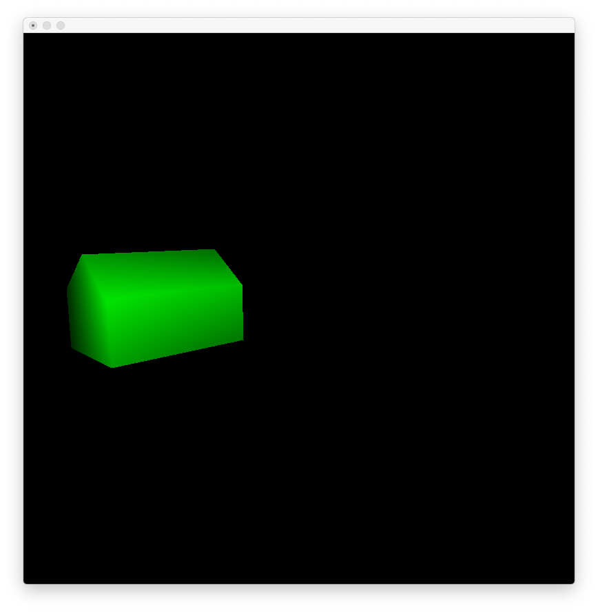
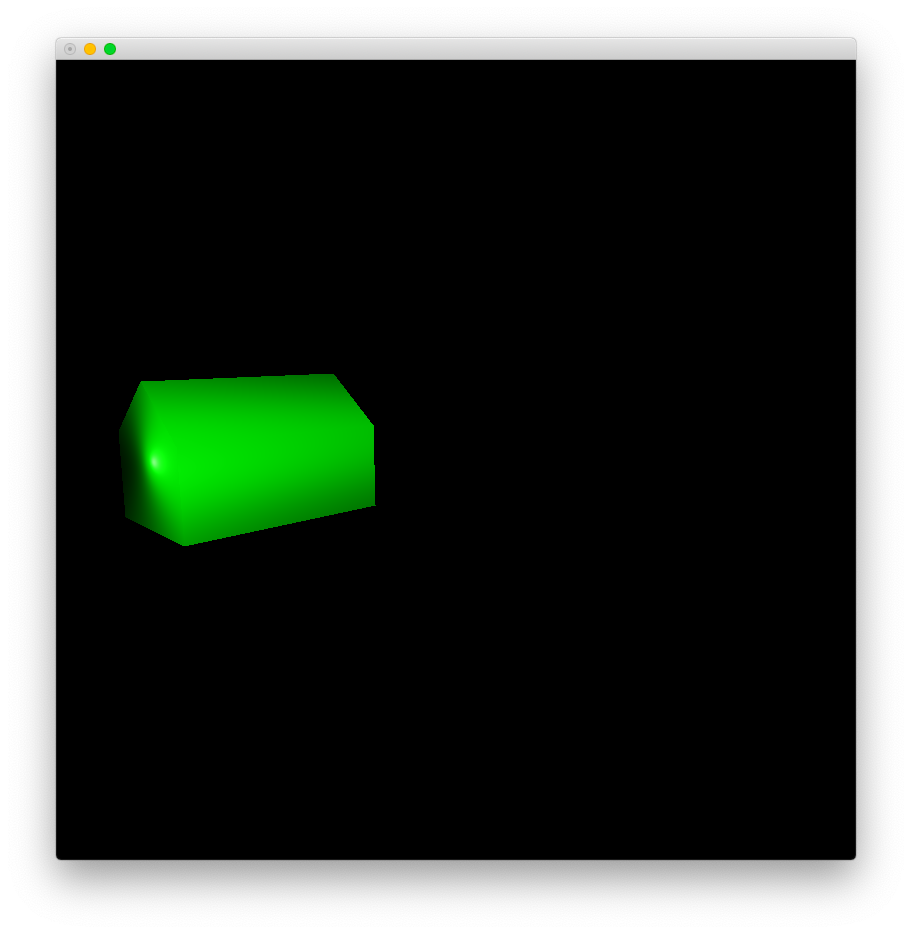
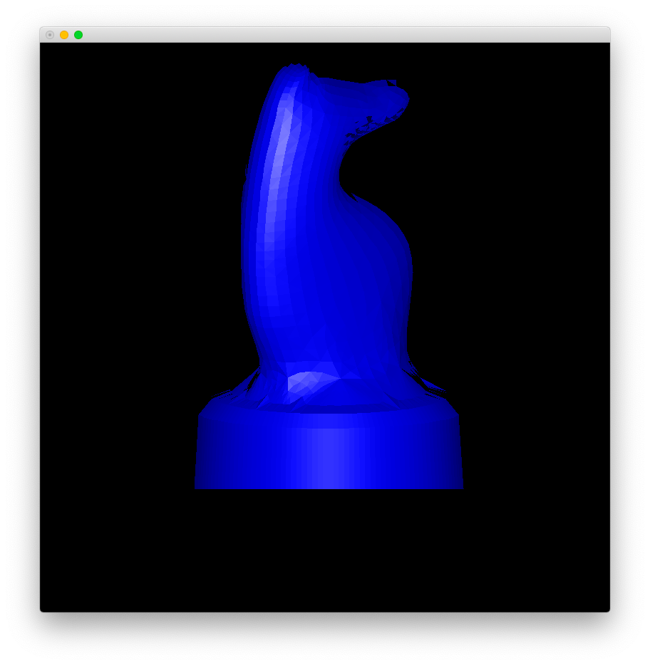
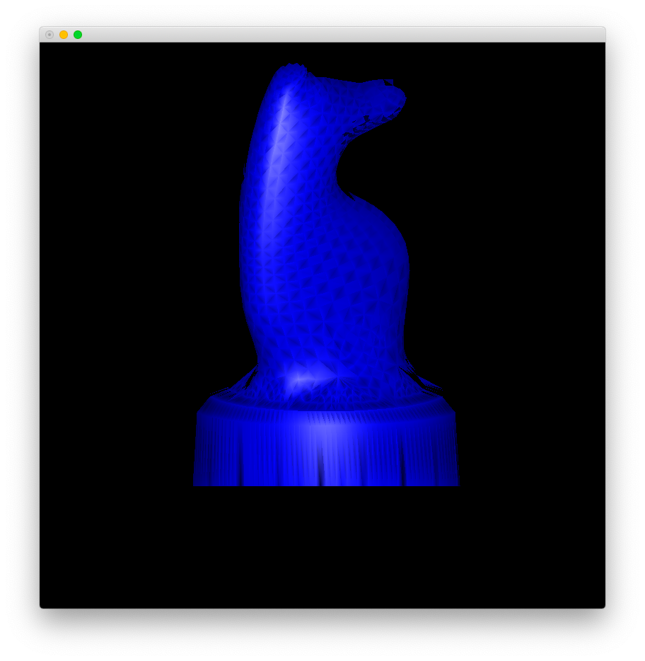
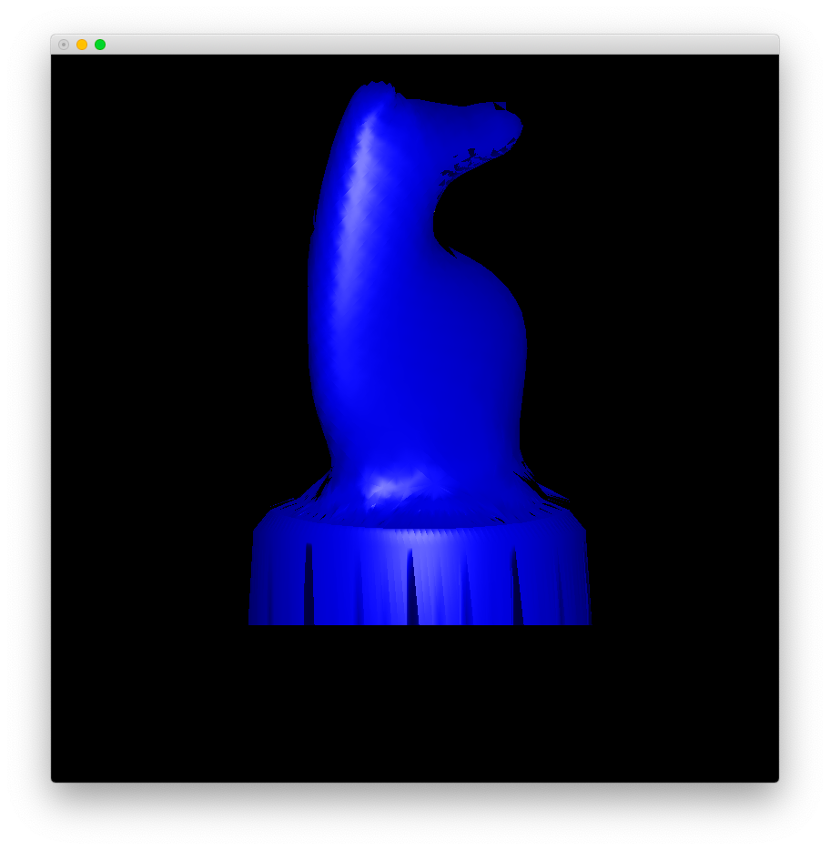

# Lab 3

Zhicheng Zhang

### Model

#### Phong Specular Illumination Model

$$
\begin{align*}
I_{\lambda}&=I_{a\lambda}k_{a}O_{d\lambda}+\sum_{i}f_{att}I_{p\lambda i}[k_{d}O_{d\lambda}(N\cdot L_{i})+k_{s}O_{s\lambda}(N\cdot \frac{L_{i}+V}{\lvert L_{i}+V\rvert})^{n}]
\end{align*}
$$

Explanation:

- $I_{\lambda}$: color - **RGB, vector3, $[0,1]$, same as below** - 颜色
- $I_{a\lambda}$: color of ambient light 环境光的颜色
- $k_{a}$: "object" reflectivity - $[0,1]$ - “物体”的反射率
- $O_{d\lambda}$: color of "object" - “物体”的颜色
- $i$: the i-th light source 第i个光源
- $f_{att}$: attenuation factor of light source - $[0,1]$ - 光源的衰减系数
- $I_{p\lambda}$: color of light source 光源的颜色
- $k_{d}$: "object" diffuse - $[0,1]$ - “物体”的漫反射率
- $N$: unit normal vector of "object" (to outside) - **vector3** - “物体”的单位法向量（指向物体外部）
- $L$: unit vector from "object" to light source - **vector3** - “物体”到光源的单位向量
- $k_{s}$: "object" diffuse in hight light - $[0,1]$ - 高光下“物体”的漫反射率
- $O_{s\lambda}$: color of highlight 高光颜色
- $V$: unit vector from "object" to camera - **vector3** - “物体”到相机的单位向量
- $n$: highlight degree ($\propto n$) 高光程度

Note:

- "Object" means the irradiation point on the object. “物体”表示物体上的照射点。
- Vectors are in 3D world space. 向量位于3D世界空间。

#### Simplification

In the lab:

- Only one light source, which is very far away. It means that $L$ is a constant.
- Camera is considered as "very far away". It means that $V$ is a constant of minus viewing direction.

The formula is simplified as:
$$
\begin{align*}
I_{\lambda}&=I_{a\lambda}k_{a}O_{d\lambda}+f_{att}I_{p\lambda}[k_{d}O_{d\lambda}(N\cdot L)+k_{s}O_{s\lambda}(N\cdot \frac{L+V}{\lvert L+V\rvert})^{n}]
\end{align*}
$$

### Usage

- Install [Python 3](https://www.python.org/).
- Install dependence by `pip3 install -r requirements.txt`.
- modify `main.py` to draw different geometries.

``` python
...

def main():

...

    # data source name
    data_source_name = 'better-ball.d'
    # shading type: 
    #   0 - no shading (framework)
    #   1 - constant shading
    #   2 - Gouraud shading
    #   3 - Phong shading
    shading = 1
    
...
```

- Execute `python3 main.py` to show.

### Result

#### Better Ball

##### Parameter

```
# camera

C 5 0 0
P_{ref} 0 0 0
V' 0 0 1

h 0.75
d 2
f 20

# light

I_{a\lambda} 1 1 1
I_{p\lambda} 1 1 1
O_{s\lambda} 1 1 1
light_direction -1 1 -1
f_{att} 1
n 24

# material
O_{d\lambda} 1 0 0
k_{a} 0.4
k_{d} 0.6
k_{s} 0.5
```

##### Constant Shading



```
Reading ...
Finish. (cost = 0:00:00.058317)

Calculating: transform ...
Finish. (cost = 0:00:00.180496)

Calculating: polygon ...
Finish. (cost = 0:00:00.638772)

Calculating: pixel ...
Finish. (cost = 0:00:07.746785)

Rendering ...
Finish. (cost = 0:00:03.034448)
```

##### Gouraud Shading


```
Reading ...
Finish. (cost = 0:00:00.039146)

Calculating: transform ...
Finish. (cost = 0:00:00.075299)

Calculating: polygon ...
Finish. (cost = 0:00:00.473926)

Calculating: vertex ...
Finish. (cost = 0:00:00.003445)

Calculating: pixel ...
Finish. (cost = 0:00:22.270171)

Rendering ...
Finish. (cost = 0:00:02.751479)
```

##### Phong Shading



```
Reading ...
Finish. (cost = 0:00:00.041376)

Calculating: transform ...
Finish. (cost = 0:00:00.089395)

Calculating: polygon ...
Finish. (cost = 0:00:00.551256)

Calculating: pixel ...
Finish. (cost = 0:00:27.737744)

Rendering ...
Finish. (cost = 0:00:03.007704)
```

#### House

##### Parameter

```
# camera

C 80 20 80
P_{ref} 0 0 0
V' 0 1 0

h 6
d 10
f 100

# light

I_{a\lambda} 1 1 1
I_{p\lambda} 1 1 1
O_{s\lambda} 1 1 1
light_direction -80 -20 -80
f_{att} 1
n 24

# material

O_{d\lambda} 0 1 0
k_{a} 0.4
k_{d} 0.6
k_{s} 0.5
```

##### Constant Shading



```
Reading ...
Finish. (cost = 0:00:00.003130)

Calculating: transform ...
Finish. (cost = 0:00:00.002316)

Calculating: polygon ...
Finish. (cost = 0:00:00.048842)

Calculating: pixel ...
Finish. (cost = 0:00:02.633948)

Rendering ...
Finish. (cost = 0:00:00.903907)
```

##### Gouraud Shading



```
Reading ...
Finish. (cost = 0:00:00.002796)

Calculating: transform ...
Finish. (cost = 0:00:00.002761)

Calculating: polygon ...
Finish. (cost = 0:00:00.047671)

Calculating: vertex ...
Finish. (cost = 0:00:00.000526)

Calculating: pixel ...
Finish. (cost = 0:00:06.631853)

Rendering ...
Finish. (cost = 0:00:00.891057)
```

##### Phong Shading



```
Reading ...
Finish. (cost = 0:00:00.003858)

Calculating: transform ...
Finish. (cost = 0:00:00.002177)

Calculating: polygon ...
Finish. (cost = 0:00:00.046717)

Calculating: pixel ...
Finish. (cost = 0:00:07.504459)

Rendering ...
Finish. (cost = 0:00:00.815841)
```

#### Knight

```
# camera

C 5 -5 0
P_{ref} 0 0 2
V' 0 0 1

h 1
d 2
f 20

# light

I_{a\lambda} 1 1 1
I_{p\lambda} 1 1 1
O_{s\lambda} 1 1 1
light_direction -5 5 2
f_{att} 1
n 24

# material

O_{d\lambda} 0 0 1
k_{a} 0.4
k_{d} 0.6
k_{s} 0.5
```

##### Constant Shading



```
Reading ...
Finish. (cost = 0:00:00.490473)

Calculating: transform ...
Finish. (cost = 0:00:00.753595)

Calculating: polygon ...
Finish. (cost = 0:00:02.673383)

Calculating: pixel ...
Finish. (cost = 0:00:06.986934)

Rendering ...
Finish. (cost = 0:00:03.120128)
```

##### Gouraud Shading



```
Reading ...
Finish. (cost = 0:00:00.489102)

Calculating: transform ...
Finish. (cost = 0:00:00.838918)

Calculating: polygon ...
Finish. (cost = 0:00:03.045303)

Calculating: vertex ...
Finish. (cost = 0:00:00.040293)

Calculating: pixel ...
Finish. (cost = 0:00:20.955558)

Rendering ...
Finish. (cost = 0:00:02.945520)
```

##### Phong Shading



```
Reading ...
Finish. (cost = 0:00:00.476315)

Calculating: transform ...
Finish. (cost = 0:00:00.754857)

Calculating: polygon ...
Finish. (cost = 0:00:02.777173)

Calculating: pixel ...
Finish. (cost = 0:00:27.323984)

Rendering ...
Finish. (cost = 0:00:03.058956)
```
