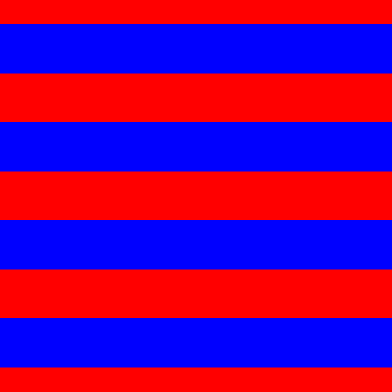
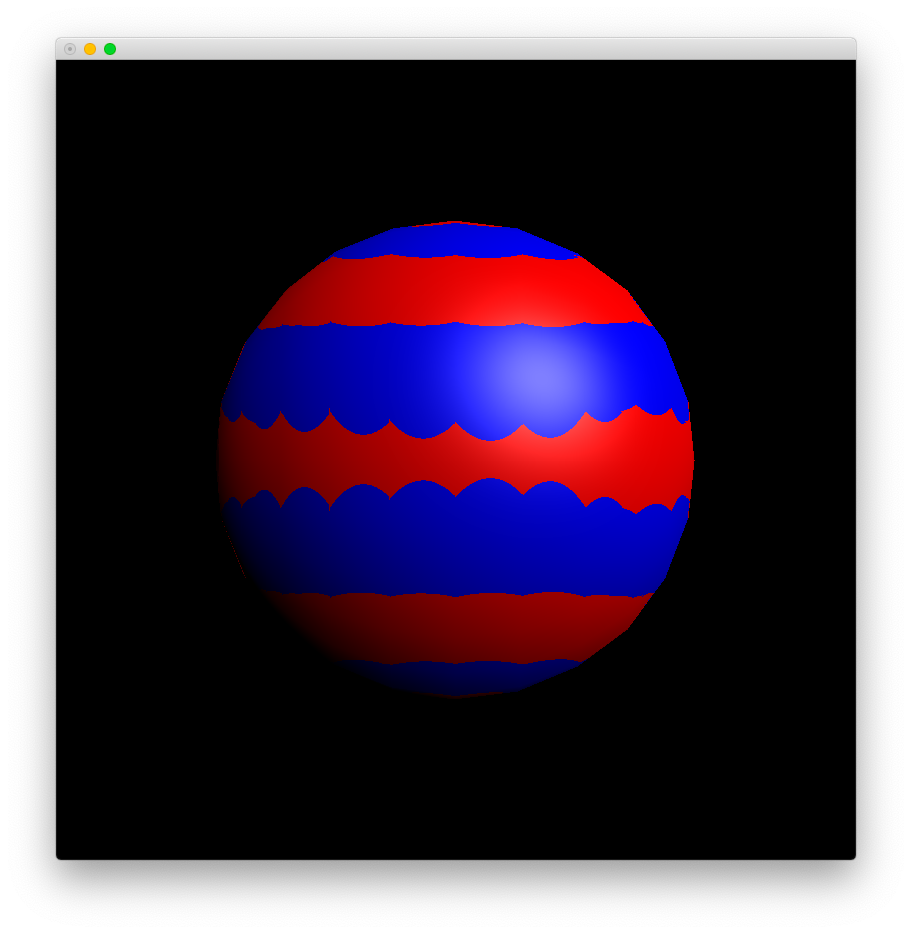
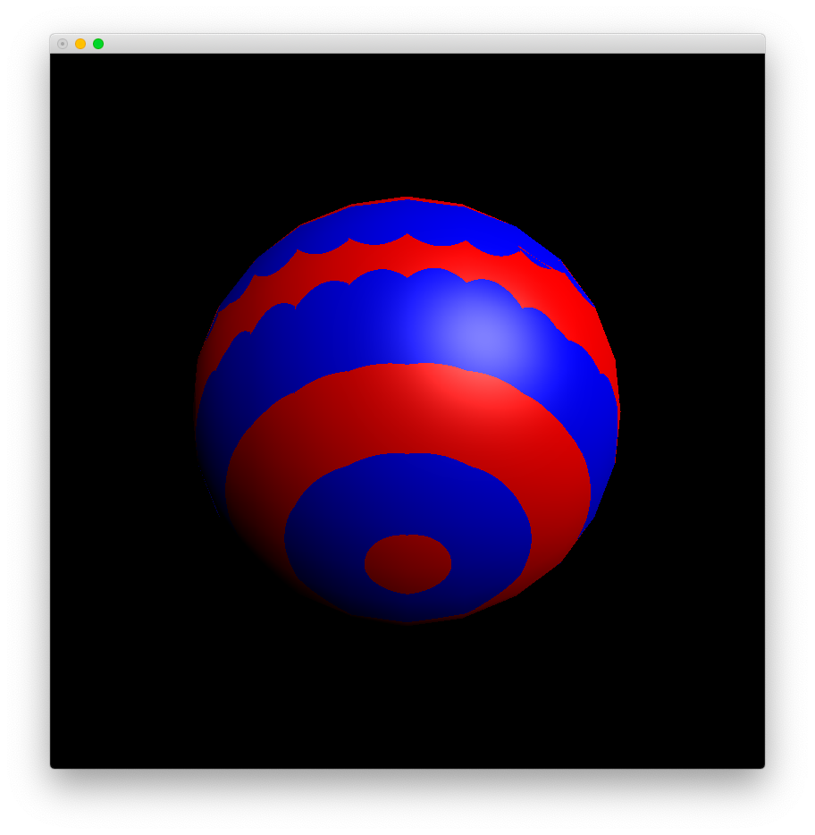
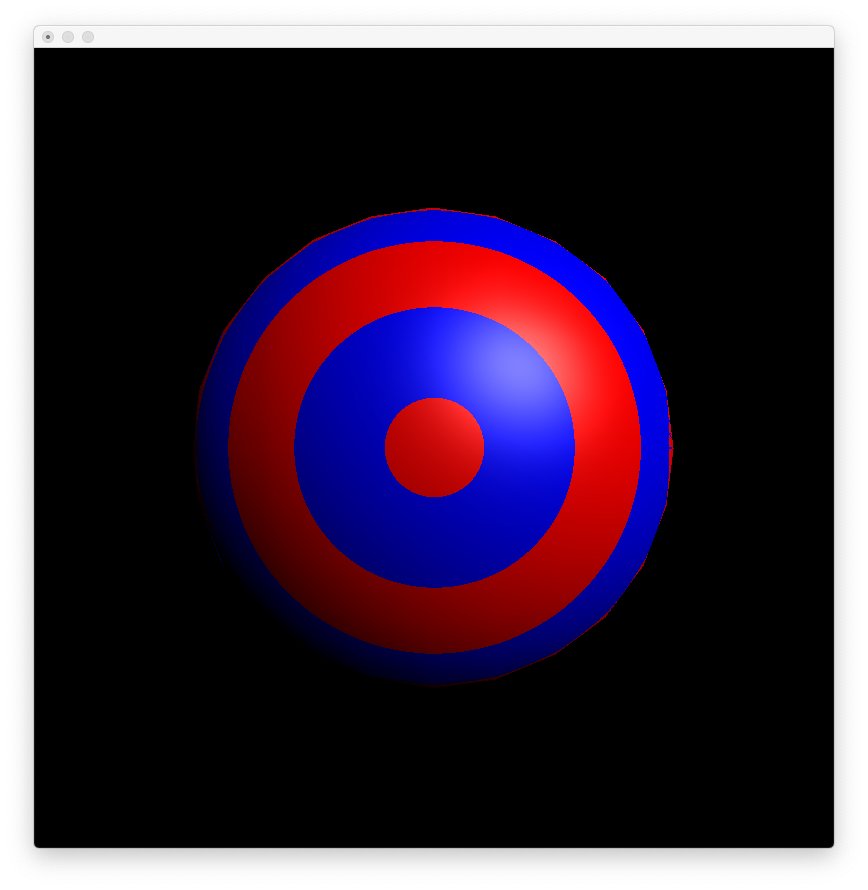

# Lab 4

Zhicheng Zhang

### Usage

- Install [Python 3](https://www.python.org/).
- Install dependence by `pip3 install -r requirements.txt`.
- Edit files in directory `data` to change parameters.
  - file `camera.p`: camera parameters
  - file `display.p`: indicate window size
  - file `light.p`: light source parameters, Phong specular illumination model
  - file `shading.p`: indicate shading type (constant, Gouraud or Phong shading)
  - file `*.d`: vertices and polygons of a geometry
  - file `*.d.lay.p`: matrices of move, rotate and scale of a geometry, 3D local space <==> 3D world space
  - file `*.d.material.p`: surface material parameters of a geometry, Phong specular illumination model
- Execute `python3 main.py` to show.

### Result

#### Texture



#### Mapping

##### 1

```
# better-ball.d.lay.p
#
# y-axiz rotate 0

move     1 0 0 0   0 1 0 0   0 0 1 0   0 0 0 1
rotate   1 0 0 0   0 1 0 0   0 0 1 0   0 0 0 1
scale    3 0 0 0   0 3 0 0   0 0 3 0   0 0 0 1
```



The boundary of red and blue area should be a straight line, but it seems not. Reasons are:

- error of roundness (pixel)
- error of interpolation

##### 2

```
# better-ball.d.lay.p
#
# y-axiz rotate pi/4

move     1 0 0 0   0 1 0 0   0 0 1 0   0 0 0 1
rotate   0.7071067811865475 0 -0.7071067811865475 0   0 1 0 0   0.7071067811865475 0 0.7071067811865475 0   0 0 0 1
scale    3 0 0 0   0 3 0 0   0 0 3 0   0 0 0 1
```



##### 3

```
# better-ball.d.lay.p
#
# y-axiz rotate pi/2

move     1 0 0 0   0 1 0 0   0 0 1 0   0 0 0 1
rotate   0 0 -1 0   0 1 0 0   1 0 0 0   0 0 0 1
scale    3 0 0 0   0 3 0 0   0 0 3 0   0 0 0 1
```



#### Console

```
Reading ...
Finish. (cost = 0:00:00.091338)

Calculating: transform ...
Finish. (cost = 0:00:00.056197)

Calculating: polygon ...
Finish. (cost = 0:00:00.564300)

Calculating: pixel ...
Finish. (cost = 0:00:54.415092)

Rendering ...
Finish. (cost = 0:00:04.700609)
```