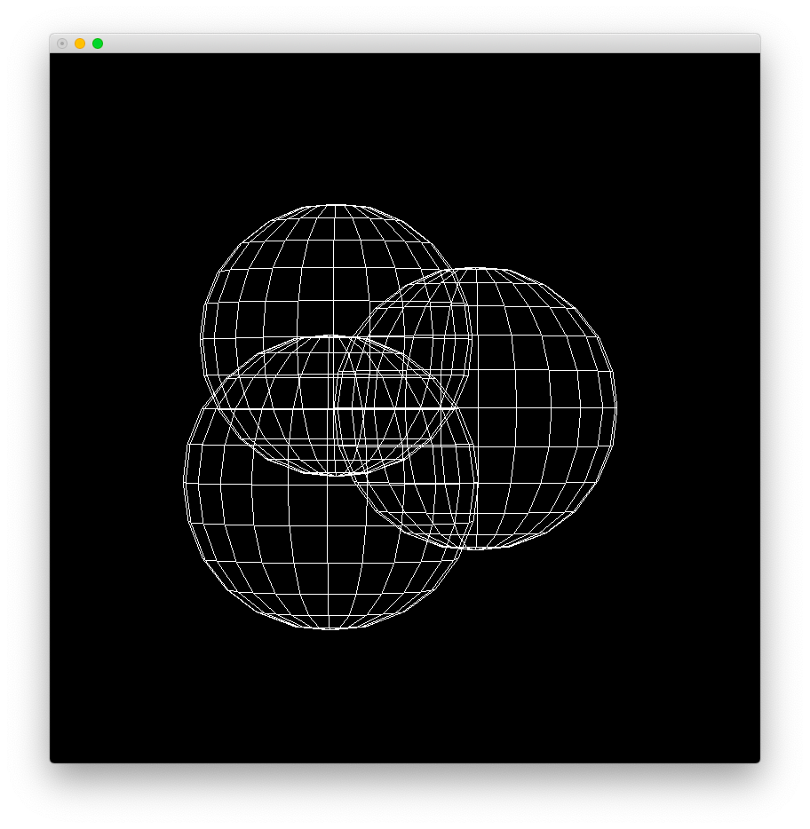
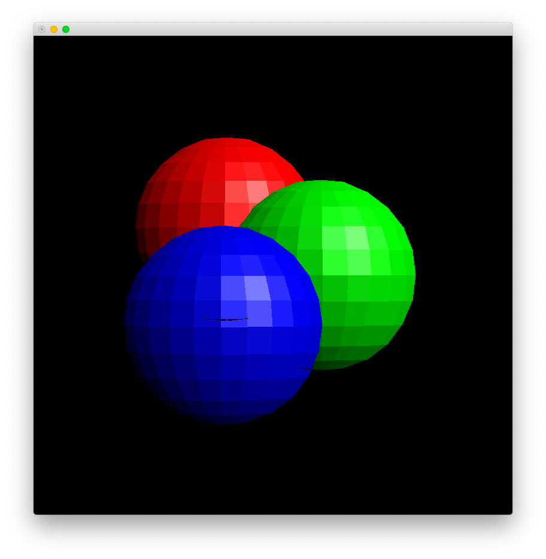

# Lab 5

Zhicheng Zhang

### Subject

Render multiple objects.

### Usage

- Install [Python 3](https://www.python.org/).
- Install dependence by `pip3 install -r requirements.txt`.
- Edit files in directory `data` to change parameters.
  - file `camera.p`: camera parameters
  - file `display.p`: indicate window size
  - file `light.p`: light source parameters, Phong specular illumination model
  - file `shading.p`: indicate shading type (constant, Gouraud or Phong shading)
  - file `*.d`: vertices and polygons of a geometry
  - file `*.d.lay.p`: matrices of move, rotate and scale of a geometry, 3D local space <==> 3D world space
  - file `*.d.material.p`: surface material parameters of a geometry, Phong specular illumination model
- Execute `python3 main.py` to show.

### Result

#### No Shading (Framework)



```
Reading ...
Finish. (cost = 0:00:00.134411)

Calculating: transform ...
Finish. (cost = 0:00:00.126830)

Calculating: polygon ...
Finish. (cost = 0:00:00.000851)

Rendering ...
Finish. (cost = 0:00:00.018046)
```

#### Constant Shading



```
Reading ...
Finish. (cost = 0:00:00.213914)

Calculating: transform ...
Finish. (cost = 0:00:00.156337)

Calculating: polygon ...
Finish. (cost = 0:00:00.932982)

Calculating: pixel ...
Finish. (cost = 0:00:17.287104)

Rendering ...
Finish. (cost = 0:00:03.703811)
```

#### Gouraud Shading


```
Reading ...
Finish. (cost = 0:00:00.247533)

Calculating: transform ...
Finish. (cost = 0:00:00.147007)

Calculating: polygon ...
Finish. (cost = 0:00:00.798333)

Calculating: vertex ...
Finish. (cost = 0:00:00.021549)

Calculating: pixel ...
Finish. (cost = 0:00:41.029397)

Rendering ...
Finish. (cost = 0:00:03.380717)
```

#### Phong Shading


```
Reading ...
Finish. (cost = 0:00:00.146792)

Calculating: transform ...
Finish. (cost = 0:00:00.171384)

Calculating: polygon ...
Finish. (cost = 0:00:01.001797)

Calculating: pixel ...
Finish. (cost = 0:00:57.686027)

Rendering ...
Finish. (cost = 0:00:03.953584)
```